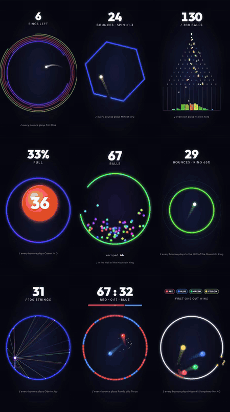

# melody-bounce

Physics videos where every collision plays the next note of a song.

Pick a scene and a melody, or bring your own MIDI file, and get a finished vertical video with the audio already
synced to the bounces. This is the engine behind the
[Melody Bounce](https://www.youtube.com/channel/UCiav9M2tUyFhAMkMJbLO0JQ) channel.

<p align="center"></p>

## Quick start

You need Node 20 or newer.

```sh
npx github:luoy16002-svg/melody-bounce render --scene rings --song fur-elise --out fur-elise.mp4
```

With your own song:

```sh
npx github:luoy16002-svg/melody-bounce render --scene hexagon --midi my-song.mid --out my-song.mp4
```

The first run takes a while: npm builds the package, Remotion downloads a headless Chrome, and the piano samples
(about 20 MB) are fetched and cached. After that, a 20-second 1080x1920 video at 60 fps renders in roughly 20 seconds
on a desktop with a GPU.

Or work from a clone:

```sh
git clone https://github.com/luoy16002-svg/melody-bounce
cd melody-bounce
npm install
node dist/cli.js render --scene galton --out galton.mp4
```

## Scenes

| scene | what happens | default song |
|---|---|---|
| `rings` | A ball bounces inside 22 spinning rings. Each ring has a gap, and the ring breaks once the ball gets through it. | Für Elise |
| `hexagon` | The spinning hexagon test with a gap in one wall. The spin speeds up with every bounce. | Minuet in G |
| `galton` | 300 balls fall through 12 rows of pegs. Each bin has its own note, so you hear the bell curve fill in. | D major pentatonic |
| `grow` | The ball gets a little bigger on every bounce until it fills the circle. | Canon in D |
| `multiply` | Every bounce adds another ball. | In the Hall of the Mountain King |
| `shrink` | The ring gets 1.5% smaller every time it is hit, until the ball no longer fits. | In the Hall of the Mountain King |
| `strings` | Each hit ties a string to the ring and speeds the ball up. The ring has to hold 100 of them. | Ode to Joy |
| `colorwar` | Two balls paint the ring in their own colour. Whoever owns more of it after 30 seconds wins. | Rondo alla Turca |
| `race` | Four balls, one small spinning exit. First one out wins. | Symphony No. 40 |

`list-scenes` and `list-songs` print the same lists.

## Options

```
melody-bounce render --scene NAME [--song NAME | --midi FILE [--track INDEX]]
  [--seed INTEGER] [--fps 1..120] [--duration SECONDS] [--format 9:16]
  [--instrument piano|synth] [--out FILE.mp4]
```

- `--seed` changes the starting conditions. The same seed always gives the same video, frame for frame.
- `--midi` takes the busiest non-drum track and uses its top voice as the melody. `--track` picks a different track.
- `--duration` cuts the video short, handy for quick previews.
- `--instrument synth` swaps the sampled piano for a small built-in synth.

Rendering uses the GPU through ANGLE on Windows and macOS, and software rendering on Linux. Set
`MELODY_BOUNCE_GL` (`angle`, `swangle`, `egl`, `vulkan`, ...) to override it, and `MELODY_BOUNCE_CONCURRENCY` to change
how many frames render in parallel (default: half your cores, at most 8). Software rendering is about 25 times slower.

## Live preview

`npm run player` (in a clone) starts a small local page that plays any scene in the browser with sound, using the same
physics and audio code.

## How it works

The physics runs at a fixed 60 Hz with substeps and a seeded random generator, so a run is fully deterministic. Every
collision is written out as an event with its exact time. The audio is built from those events: each hit takes the
next note of the melody, notes that would land too close together are thinned out, and each sample starts on the
exact audio frame of its hit. The picture is a set of [Remotion](https://www.remotion.dev) compositions that read the
same simulation data, so sound and picture can't drift apart.

The scenes started life as Python scripts. The TypeScript port is checked against their output in the test suite
(`npm test`), down to the frame of every event.

## Licenses

- Code: MIT.
- Rendering uses Remotion, which has its own license: free for individuals and for companies of up to three
  people; larger companies need a company license. Details in [LICENSE-NOTES.md](LICENSE-NOTES.md).
- Piano samples: VSCO-2 Community Edition, CC0.
- The melodies are public-domain compositions.
